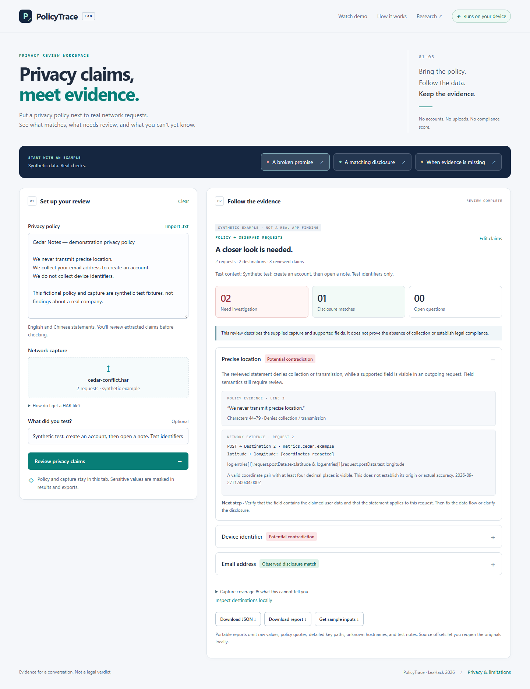

# PolicyTrace

**Privacy claims, meet evidence.** A local-first workspace for reviewing privacy policy statements against captured HTTP requests.

Built for the **Digital Rights & Policy Tech** track at LexHack 2026 by **GUANGRUI LI**. Independent project created during the event.

## Try it

[Open the application](https://policytrace-lexhack-2026.sundaysebasidian.chatgpt.site) · [Watch the 111-second demo](https://policytrace-lexhack-2026.sundaysebasidian.chatgpt.site/demo.html)

Or run locally:

```sh
npm start
```

Visit `http://127.0.0.1:4173`. Node.js 22+ is required for the local server and tests. There are **no runtime dependencies, API keys, paid services, or accounts required** to use the application.

1. Choose **A broken promise**, **A matching disclosure**, or **When evidence is missing**; or paste a policy and import your own HAR.
2. Review the extracted source quotes and their meaning. Keep conditional or recipient-specific statements undecided unless their scope is established. Missed statements can be added by selecting policy text.
3. Confirm the claims and run the evidence check.
4. Inspect the policy source offsets and request references behind each finding. Inspect destination hostnames locally when needed.
5. Export a masked JSON or Markdown review with SHA-256 input fingerprints.

Every bundled example is **synthetic**, not a finding about a real app. The broken-promise fixture produces two potential contradictions and one data-type match; the matching fixture produces three matches; the missing-payload fixture produces two insufficient-evidence results.

## Screenshots



## Why it exists

Privacy promises are hard to compare with what an application actually transmits. A reviewer should be able to point to both a policy sentence and a request, while distinguishing a visible conflict from missing evidence. PolicyTrace makes that narrow review accessible without uploading the capture to another service.

## What the prototype checks

| Category | Visible evidence required |
| --- | --- |
| Precise location | Recognized latitude/longitude keys in the same object, valid numeric ranges, both with at least four decimal places. Origin and real accuracy still need review. |
| Email address | An email-shaped value in a recognized email field. |
| Device identifier | A non-empty, non-placeholder value in a recognized device or advertising identifier field. Uniqueness is not established. |

It reads URL queries, HAR `queryString`, JSON request bodies, and form-encoded bodies or HAR form parameters. It does not inspect arbitrary field names, headers, responses, binary or encoded payloads, server-side processing, retention, deletion, or offline collection.

## Five outcomes, with boundaries

| Outcome | Meaning |
| --- | --- |
| Potential contradiction | Visible supported data conflicts with the reviewed denial. Verify field semantics and policy scope. |
| Observed disclosure match | A visible data type has a compatible reviewed disclosure. It does not establish overall compliance, consent, purpose, or recipient obligations. |
| Disclosure not located | A visible type has no included recognized policy claim. The extractor may have missed a broader disclosure. |
| Not observed in capture | No recognized instance was found in the visible, supported requests. This is not proof of absence. |
| Insufficient evidence | Missing payloads or policy ambiguity prevent a supported decision. |

The policy extractor uses **conservative patterns, not a runtime LLM**. It supports selected English and Chinese phrasing and requires human review. Conditions and contradictory statements trigger abstention. This is an evidence review tool, not a legal verdict or compliance certificate.

## Privacy and integrity

- Inputs remain in tab memory. No application analytics, capture upload, cookies, or browser storage are used. The hosting provider still handles ordinary site access requests.
- Portable exports omit raw values, credential headers, URL paths, unknown hostnames, detailed JSON keys, policy quotes, and free-form notes. They retain categories, source offsets, request indices and timestamps. Review before sharing: masking is not a guarantee of anonymity.
- Full SHA-256 fingerprints identify the policy text and decoded HAR text used for a review; they do not prove the capture is authentic or attributable to a particular app.
- Only use captures you are authorized to inspect.

## Validation

```sh
npm test
npm run check
```

The repository includes regression tests for all five outcomes, policy conditions and contradictions, quoted-source integrity, nested JSON, queries/forms, coordinate boundaries, placeholders, oversized/malformed input, missing payloads, and export redaction. Browser QA covers the full import/review/export workflow, responsive layouts, injection-like text, invalidation of stale results, local-only behavior, and progressive WebMCP integration in a registry harness.

For browser QA, run `npm install`, `npx playwright install chromium`, start `npm start` in another terminal, then run `npm run test:browser`. Set `PLAYWRIGHT_EXECUTABLE_PATH` only when using an existing compatible browser. `npm run test:capture` records real browser HTTP traffic against a controlled local endpoint using synthetic values, then checks the resulting HAR. It passed with two contradictions and one disclosure match.

These synthetic checks verify implemented behavior. They are not an independent real-world accuracy benchmark. Native WebMCP support is optional and not required for the ordinary interface.

## Architecture

```text
dist/engine.js       Pure parsing, extraction, evidence classification, safe export
dist/examples.js     Three transparent synthetic fixtures
dist/app.js          Accessible, responsive review workflow and optional WebMCP tools
dist/styles.css      Product-specific visual system; mobile and print layouts
tests/              Deterministic regression tests (Node's built-in test runner)
scripts/serve.mjs    Dependency-free local static server
```

Client-only ES modules make the same application work on any static host. Input limits bound file size, request count, extraction count, nesting, and field traversal.

## Research and credits

Flow-to-policy consistency analysis is established research. Relevant prior work includes [PoliCheck](https://www.usenix.org/conference/usenixsecurity20/presentation/andow) and [PoliGraph](https://arxiv.org/abs/2210.06746). This prototype's contribution is its focused local review workflow, traceable evidence, and explicit uncertainty; it does not claim to invent the underlying concept.

Built with JavaScript, HTML, CSS, Node.js and browser Web Crypto. Playwright was used for development QA. Codex assisted with architecture, implementation, testing and review; the Antigravity CLI was used for a bounded submission-copy task, subject to review. No generated policy statements or fabricated real-world findings are presented as evidence.

Future work: independent real-app evaluation, additional detectors, richer policy interpretation, recipient verification, and regression comparisons. These are not implemented claims.

## License

MIT. See [LICENSE](LICENSE).
